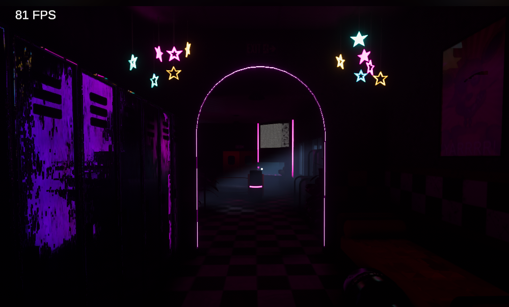
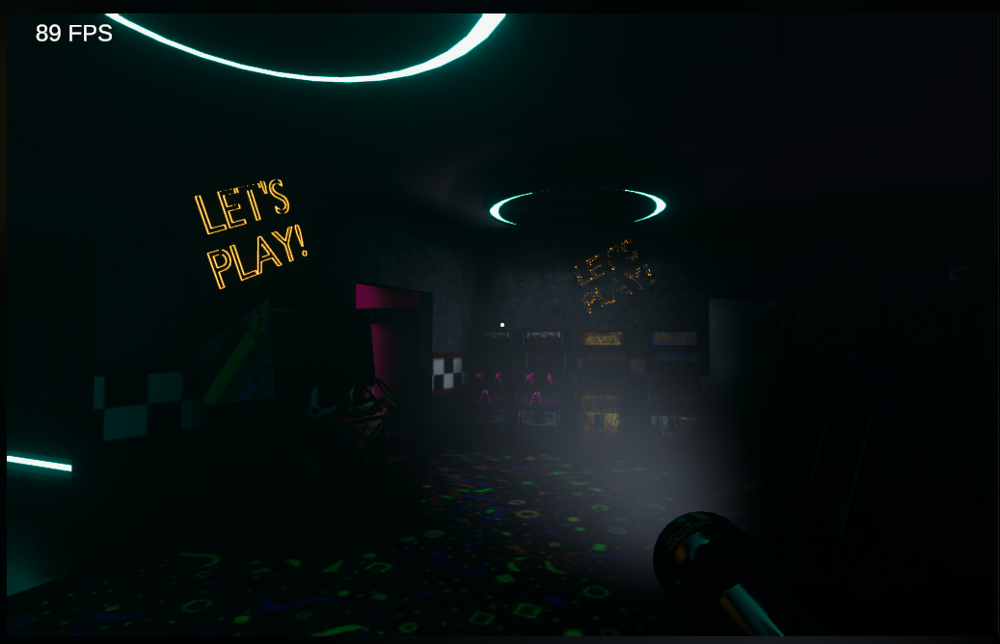

# Fan Horror Gameplay Prototype

An unofficial, non-commercial fan-made horror prototype inspired by
Five Nights at Freddy’s: Security Breach, developed in Unity and C#.

The project explores first-person horror gameplay, enemy behaviour,
environmental interactions, lighting and atmosphere.

## Gameplay Demo

▶️ [Watch the full gameplay demo on YouTube](https://www.youtube.com/watch?v=4KkIqa3QxSk)

## Gaze-Based Enemy AI

The robot moves toward the player only when it is outside their view
and immediately stops when observed. This forces the player to balance
navigation with constantly monitoring the enemy.

If the robot gets close enough, it triggers a jumpscare sequence.

▶️ [Watch the enemy AI and jumpscare demo](https://youtu.be/h4losIsnWsg)

## Environment and Atmosphere

The prototype uses contrasting neon lighting, dark interiors and
environmental fog to create an unsettling entertainment-complex atmosphere.

  
  

## Features

- First-person exploration
- Gaze-based enemy behaviour
- Enemy pursuit and jumpscare sequence
- Security-camera monitoring
- Interactive environment
- Flashlight gameplay
- Atmospheric lighting, fog and audio
- Survival-horror mechanics

## My Contribution

I implemented the gameplay systems and assembled the playable experience
in Unity. My work included enemy behaviour, player interactions, gameplay
logic, lighting, audiovisual integration and level assembly.

The prototype was created using a combination of original work and
third-party assets.

## Project Status

This is an archived learning prototype rather than a finished commercial
game. The source code and complete Unity project are not publicly available.

## Technologies

- Unity
- C#
- Gameplay Programming
- AI Behaviour
- Level Design
- Prototyping

## Disclaimer

This is an unofficial, non-commercial fan-made project inspired by
Five Nights at Freddy’s. It is not affiliated with or endorsed by
Scott Cawthon, Steel Wool Studios or any related rights holders.

Third-party assets remain the property of their respective creators.
